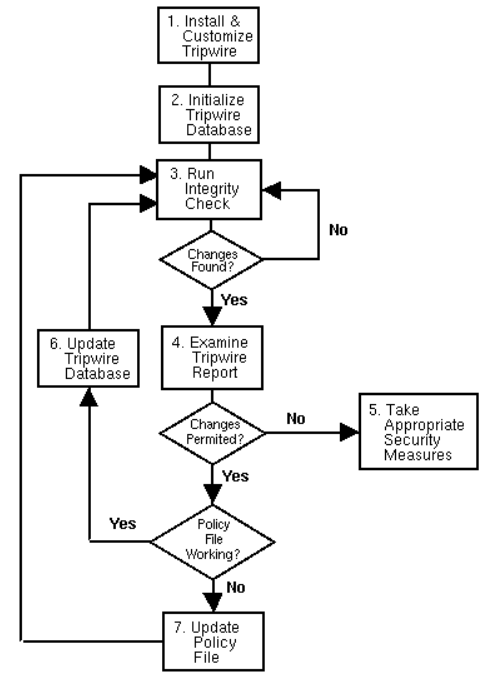
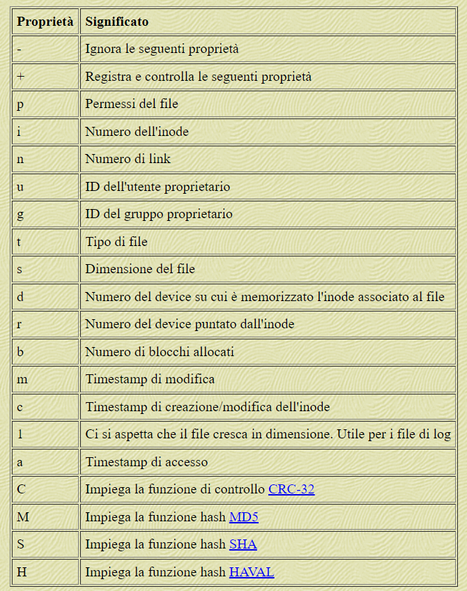

# Integrity-with-TPM

This repository shows how to use the Trusted Platform Module (TPM) to ensure the integrity of data, files, etc. on a Debian 10 virtual machine managed via VirtualBox. The choice of VirtualBox is motivated by the possibility of simulating the TPM.

## Setup
The procedure described here was tested using Debian 10.13.0-amd64 on a virtual machine created with VirtualBox version 7. It is important to use the latest version of VirtualBox because it allows you to emulate a TPM module. When creating a new virtual machine, VirtualBox requires preliminary information. In this phase it is necessary to select the *Abilita EFI* flag.
After carrying out these first configurations, you need to open the VM settings and under the *System* item, enable Secure Boot and select the TPM version to use.
At this point you can proceed with the installation of Debian. In this scenario, the disk was manually partitioned (60 GB of memory) and six partitions were created: 

* **ESP** 
* **boot** 
* **root (/)**
* **home**
* **secrets**
* **swap**

## TPM-tss
Trusted Computing Group's (TCG) TPM2 Software Stack (TSS consists of the following layers from top to bottom:
| Name | Libraries |  &nbsp;&nbsp;&nbsp;&nbsp;&nbsp;&nbsp;&nbsp;&nbsp;&nbsp;&nbsp;&nbsp;&nbsp;&nbsp;&nbsp;&nbsp;&nbsp;&nbsp;&nbsp;&nbsp;&nbsp;&nbsp;&nbsp;&nbsp;&nbsp;&nbsp;Description&nbsp;&nbsp;&nbsp;&nbsp;&nbsp;&nbsp;&nbsp;&nbsp;&nbsp;&nbsp;&nbsp;&nbsp;&nbsp;&nbsp;&nbsp;&nbsp;&nbsp;&nbsp;&nbsp;&nbsp;&nbsp;&nbsp;&nbsp;&nbsp;&nbsp; | Specifications |
|---|---|---|---|
| Feature API (FAPI) | libtss2&#x2011;fapi | High-level API for simple TPM usage | [TCG Feature API (FAPI) Specification](https://trustedcomputinggroup.org/wp-content/uploads/TSS_FAPI_v0p94_r09_pub.pdf),<br>[TCG TSS 2.0 JSON Data Types and Policy Language Specification](https://trustedcomputinggroup.org/wp-content/uploads/TSS_JSON_Policy_v0p7_r08_pub.pdf) |
| Enhanced System API (ESAPI,&nbsp;sometimes&nbsp;ESYS) | libtss2&#x2011;esys | 1-to-1 mapping of the TPM2 commands<ul><li> Session handling</li><li>Tracks meta data for TPM objects</li><li>Asynchronous calls</li></ul> | [TCG TSS 2.0 Enhanced System API (ESAPI) Specification](https://trustedcomputinggroup.org/wp-content/uploads/TSS_ESAPI_v1p0_r08_pub.pdf) |
| System API (SAPI,&nbsp;sometimes&nbsp;SYS) | libtss2&#x2011;sys | 1-to-1 mapping of the TPM2 commands<ul><li>Asynchronous calls</li></ul> | [TCG TSS 2.0 System Level API (SAPI) Specification](https://trustedcomputinggroup.org/wp-content/uploads/TSS_SAPI_v1p1_r29_pub_20190806.pdf) |
| Marshaling/Unmarshaling (MU) | libtss2&#x2011;mu | (Un)marshaling all data types in the TPM library specification | [TCG TSS 2.0 Marshaling/Unmarshaling API Specification](https://trustedcomputinggroup.org/wp-content/uploads/TCG_TSS_Marshaling_Unmarshaling_API_v1p0_r07_pub.pdf) |
| TPM Command Transmission Interface (TCTI) | libtss2&#x2011;tcti&#x2011;device<br>libtss2&#x2011;tcti&#x2011;tbs<br> libtss2&#x2011;tctildr<br>libtss2&#x2011;tcti&#x2011;swtpm<br>&#8230; | Standard API to transmit/receive TPM commands and responses<br><br>See [doc/tcti.md](doc/tcti.md) | [TCG TSS 2.0 TPM Command Transmission Interface (TCTI) API Specification](https://trustedcomputinggroup.org/wp-content/uploads/TCG_TSS_TCTI_v1p0_r18_pub.pdf) |
||| Basis for all implementations in this project. [1] | [TCG TSS 2.0 Overview and Common Structures Specification](https://trustedcomputinggroup.org/wp-content/uploads/TCG_TSS_Overview_Common_Structures_v0.9_r03_published.pdf) |

### Dependencies
To build and install the tpm2-tss software the following software packages
are required: 
* GNU Autoconf
* GNU Autoconf Archive, version >= 2019.01.06
* GNU Automake
* GNU Libtool
* C compiler
* C library development libraries and header files
* pkg-config
* doxygen
* OpenSSL development libraries and header files, version >= 1.1.0
* libcurl development libraries
* Access Control List utility (acl)
* JSON C Development library
* Package libusb-1.0-0-dev

*Code to install dependencies*:
```
$ sudo apt -y update
$ sudo apt -y install \
  autoconf-archive \
  libcmocka0 \
  libcmocka-dev \
  procps \
  iproute2 \
  build-essential \
  git \
  pkg-config \
  gcc \
  libtool \
  automake \
  libssl-dev \
  uthash-dev \
  autoconf \
  doxygen \
  libjson-c-dev \
  libini-config-dev \
  libcurl4-openssl-dev \
  uuid-dev \
  libltdl-dev \
  libusb-1.0-0-dev \
  libftdi-dev
```

> [!NOTE]
> To install JSON C Development library use apt:
> ```sh
> $ sudo apt install git, cmake, valgrind
> $ git clone https://github.com/json-c/json-c.git
> $ mkdir json-c-build
> $ cd json-c-build
> $ cmake ../json-c   # See CMake section below for custom arguments
> $ make
> $ make test
> $ make USE_VALGRIND=0 test   # optionally skip using valgrind
> $ sudo make install          # it could be necessary to execute make install
> ```

### Building
Continue with tpm2-tss:
```sh
$ git clone https://github.com/tpm2-software/tpm2-tss.git
$ cd tpm2-tss
$ ./bootstrap
$ ./configure --prefix=/usr/local --with-udevrulesdir=/etc/udev/rules.d
$ make -j$(nproc)
$ sudo make install
$ sudo usermod -aG tss tss #use root if you are root
$ sudo ldconfig
$ export PATH=/usr/local/bin:$PATH
$ source ~/.bashrc
```

## TPM-tools
### Dependencies
To build and install the tpm2-tools software the following software is required:
* GNU Autoconf (version >= 2019.01.06)
* GNU Automake
* GNU Libtool
* pkg-config
* C compiler
* C Library Development Libraries and Header Files (for pthreads headers)
* ESAPI - TPM2.0 TSS ESAPI library (tss2-esys) and header files
* OpenSSL libcrypto library and header files (version >= 1.1.0)
* Curl library and header files
#### Optional Dependencies:
* To build the man pages you need [pandoc](https://github.com/jgm/pandoc)
* FAPI - TPM2.0 TSS FAPI library (tss2-fapi) and header files
* To enable the new userspace resource manager, one must get tpm2-tabrmd
  (**recommended**).
* When ./configure is invoked with --enable-unit or --enable-unit=abrmd,
  the tests are run towards a resource manager, tpm2-abrmd, which must be on $PATH.
* When ./configure is invoked with --enable-unit=mssim, the tests are run directly
  towards tpm_server, without resource manager.
* For the tests, with or without resource manager, tpm_server must be installed.
* Some tests pass only if xxd, expect, bash and python with PyYAML are available
* Some tests optionally use (but do not require) curl

*Code to install dependencies*:
```
$ sudo apt-get install autoconf automake libtool pkg-config gcc libssl-dev libcurl4-gnutls-dev python-yaml libglib2.0-dev
```

#### Typical Distro Dependency Installation

Here we are going to satisfy tpm2-tools dependencies with:
* tpm2-tss: <https://github.com/tpm2-software/tpm2-tss>
* tpm2-abrmd: <https://github.com/tpm2-software/tpm2-abrmd>
* TPM simulator: <https://downloads.sourceforge.net/project/ibmswtpm2/ibmtpm1332.tar.gz>

### Building
```sh
$ git clone https://github.com/tpm2-software/tpm2-tools.git
$ cd tpm2-tools
$ ./bootstrap
$ ./configure --prefix=/usr/local 
$ make -j$(nproc)
$ sudo make install
$ export PATH=/usr/local/bin:$PATH
$ source ~/.bashrc
```
*Check the version*:
```
$ tpm2_getrandom --version
```

## TPM-abrmd
It is a system daemon implementing the TPM2 access broker (TAB) & Resource Manager (RM) spec from the TCG. The daemon (tpm2-abrmd) is implemented using Glib and the GObject system.
### Dependencies
To build and install the tpm2-abrmd software the following dependencies are
required:
* GNU Autoconf
* GNU Autoconf archive
* GNU Automake
* GNU Libtool
* C compiler
* C Library Development Libraries and Header Files (for pthreads headers)
* pkg-config
* glib and gio 2.0 libraries and development files
* libtss2-sys, libtss2-mu and TCTI libraries from https://github.com/tpm2-software/tpm2-tss
* dbus

> [!NOTE]
> Different GNU/Linux distros package glib-2.0 differently and so additional packages may be required. The tabrmd requires the GObject and GIO D-Bus support from glib-2.0 so please be sure you have whatever packages your distro provides are installed for these features.

**System User & Group**

`tpm2-abrmd` must run as user `tss` or `root`.
As is common security practice we encourage *everyone* to run the `tpm2-abrmd`
as an unprivileged user. This requires creating a user account and group to
use for this purpose. Our current configuration assumes that the name for this
user and group is `tss` per the norm established by the `trousers` TPM 1.2
software stack. This account and the associated group must be created before running the
daemon. The following command should be sufficient to create the `tss`
account:
```
$ sudo useradd --system --user-group tss
```

You may wish to further restrict this user account based on your needs. This
topic however is beyond the scope of this document.
> [!WARNING]
> To run tpm2-abrmd as root, which is not recommended, use the `--allow-root`
option.


**Obtaining the Source Code**

As is always the case, you should check for packages available through your
Linux distro before you attempt to download and build the tpm2-abrmd from
source code directly. If you need a newer version than provided by your
Distro of choice then you should download our latest stable release here:
https://github.com/01org/tpm2-abrmd/releases/latest.

The latest unstable development work can be obtained from the Git VCS here:
https://github.com/01org/tpm2-abrmd.git. This method should be used only by
developers and should be assumed to be unstable.

The remainder of this document assumes that you have:
* obtained the tpm2-abmrd source code using a method described above
* extracted the source code if necessary
* set your current working directory to be the root of the tpm2-abrmd source
tree

### Building
If you're looking to contribute to the project then you will need to build
from the project's git repository. Building from git requires some additional
work to "bootstrap" the autotools machinery. 

**Configure the Build**

The source code for must be configured before the tpm2-abrmd can be built. In
the most simple case you may run the `configure script without any options:

If your system is capable of compiling the source code then the `configure`
script will exit with a status code of `0`. Otherwise an error code will be
returned.

**Custom `./configure` Options**

In many cases you'll need to provide the `./configure` script with additional
information about your environment. Typically you'll either be telling the
script about some location to install a component, or you'll be instructing
the script to enable some additional feature or function. We'll cover each
in turn.

Invoking the configure script with the `--help` option will display
all supported options.

The default values for GNU installation directories are documented here:
https://www.gnu.org/prep/standards/html_node/Directory-Variables.html

**D-Bus Policy: `--with-dbuspolicydir`**

The `tpm2-abrmd` claims a name on the D-Bus system bus. This requires policy
to allow the `tss` user account to claim this name. By default the build
installs this configuration file to `${sysconfdir}/dbus-1/system.d`. We allow
this to be overridden using the `--with-dbuspolicydir` option.

Using Debian (and it's various derivatives) as an example we can instruct the
build to install the dbus policy configuration in the right location with the
following configure option:
```
--with-dbuspolicydir=/etc/dbus-1/system.d
```

**Systemd**

In most configurations the `tpm2-abrmd` daemon should be started as part of
the boot process. To enable this we provide a systemd unit as well as a
systemd preset file.

**Systemd Uint: `--with-systemdsystemunitdir`**

By default the build installs this file to `${libdir}/systemd/system. Just
like D-Bus the location of unit files is distro specific and so you may need
to configure the build to install this file in the appropriate location.

Again using Debian as an example we can instruct the build to install the
systemd unit in the right location with the following configure option:
```
--with-systemdsystemunitdir=/lib/systemd/system
```

**Systemd Preset Dir: `--with-systemdpresetdir=DIR`**

By default the build installs the systemd preset file for the tabrmd to
`${libdir}/systemd/system-preset`. If you need to install this file to a
different directory pass the desired path to the `configure` script using this
option. For example:
```
--with-systemdpresetdir=/lib/systemd/system-preset
```

**Systemd Preset Default: `--with-systemdpresetdisable`**

The systemd preset file will enable the tabrmd by default, causing it to be
started by systemd on boot. If you wish for the daemon to be disabled by
default some reason you may use this option to the `configure` script to do
so.


**`--datarootdir`**

To override the system data directory, used for
${datadir}/dbus-1/system-services/com.intel.tss2.Tabrmd.service,
use the `--datarootdir` option.
Using Debian as an example we can instruct the build to install the
DBUS service files in the right location with the following configure option:
```
--datarootdir=/usr/share
```
*Building Code*:
```
$ git clone https://github.com/tpm2-software/tpm2-abrmd.git
$ cd tpm2-abrmd
$ ./bootstrap
$ ./configure --with-dbuspolicydir=/etc/dbus-1/system.d
--with-systemdsystemunitdir=/usr/lib/systemd/system
--libdir=/usr/lib64 --prefix=/usr/local
$ make -j5
$ sudo make install
$ export PATH=/usr/local/bin:$PATH
$ source ~/.bashrc
```

> [!NOTE]
> It may be necessary to run ldconfig (as root) to update the run-time
bindings before executing a program that links against the tabrmd library:
> ```
> $ sudo ldconfig
> ```

**Post-install**

After installing the compiled software and configuration all components with
new configuration (Systemd and D-Bus) must be prompted to reload their configs.
This can be accomplished by restarting your system but this isn't strictly
necessary and is generally considered bad form.
Instead each component can be instructed to reload its config manually. The
following sections describe this process for each.

**D-Bus**

The dbus-daemon will also need to be instructed to read this configuration
file (assuming it's installed in a location consulted by dbus-daemon) before
the policy will be in effect. This is typically accomplished by sending the
`dbus-daemon` the `HUP` signal like so:
```
$ sudo pkill -HUP dbus-daemon
```

**Systemd**

Assuming that the `tpm2-abrmd` unit was installed in the correct location for
your distro Systemd must be instructed to reload it's configuration. This is
accomplished with the following command:
```
$ systemctl daemon-reload
```
Once systemd has loaded the unit file you should be able to use `systemctl`
to perform the start / stop / status operations as expected. Systemd should
also now start the daemon when the system boots.

> [!WARNING]
> If tpm-abrmd service is not in an active state, but has errors such as *Failed to open specified TCTI device file /dev/tpm0: Permission denied* or *A dependency job for tpm2-abrmd.service failed* or *Refusing to run as a root*, you can resolve the issue:
> ```
> sudo nano /etc/systemd/system/tpm2-abrmd.service
> ```
> Control where tpm2-abrmd binary is with the command *which tpm2-abrmd*. Then copy the *tpm2-abrmd_configuration.txt* file.
> ```
> sudo systemctl daemon-reload
> sudo systemct start tpm2-abrmd
> sudo systemct enable tpm2-abrmd
> sudo systemctl status tpm2-abrmd
> ```

> [!NOTE]
> If you still encounter errors related to running as root, use the option *--allow-root* and copy the *tpm2-abrmd_root_configuration.txt* file:
> ```
> sudo nano /etc/systemd/system/tpm2-abrmd.service
> sudo systemctl daemon-reload
> sudo systemct start tpm2-abrmd
> sudo systemct enable tpm2-abrmd
> sudo systemctl status tpm2-abrmd
> ```

## Use TPM without Clevis
After manually installing everything we need, the time has come to use the TPM version 2.0 for data or application encryption to guarantee their integrity. In particular, we will consider 2 different TPM usage scenarios:
* Direct communication with the TPM with possible variations
* Using Tripwire with TPM

### First Scenario
The first scenario consists of creating a simple bash script that will be encrypted using the TPM, or specifically *tpm2-tools*.
We then create the script, encrypt it, and decrypt it at execution time.
*Creating the script*
> ```
> echo '#!/bin/bash' > tpm_app.sh
> echo 'echo "Script protetto dal TPM!"' >> tpm_app.sh
> chmod +x tpm_app.sh
> ```
*Creating the context (TPM root key)*
> ```
> tpm2_createprimary -C o -c context.ctx 
> ```
*Creation of an AES-256 key generated and managed directly by the TPM*
> ```
> tpm2_create -G aes256 -u key.pub -r key.priv -C context.ctx -c aes_key.ctx
> ```
*Encryption and Decryption of the script with the AES-256 key*
> ```
> tpm2_encryptdecrypt -c aes_key.ctx -o tpm_app.sh.enc tpm_app.sh
> tpm2_encryptdecrypt -c aes_key.ctx -d -o tpm_app.sh.dec tpm_app.sh.enc
> ```
*Running the script after the decryption*
> ```
> chmod +x tpm_app.sh.dec
> ./tpm_app.sh.dec
> shred -u tpm_app.sh.dec
> ```

>[!CAUTION]
> If you encounter an error like **Invalid object key authorization** you can resolve the problem by entering an authentication password:
> ```
> tpm2_create -G aes256 -u key.pub -r key.priv -C context.ctx -c aes_key.ctx -p ""
> tpm2_encryptdecrypt -c aes_key.ctx -o tpm_app.sh.enc tpm_app.sh -p ""
> tpm2_encryptdecrypt -c aes_key.ctx -d -o tpm_app.sh.dec tpm_app.sh.enc -p ""
> ```

>[!NOTE]
> When creating the key, it is also possible to specify the PCR values ​​with which to seal the key with the *-L pcrs.ctx* option.

### Second Scenario
The second scenario consists of using TPM with Tripwire for integrity monitoring.
#### Tripwire
Tripwire is a security tool that allows you to monitor changes made to files and directories compared to a secure baseline state. In this scenario, it is applied to the root partition.



Tripwire uses a policy file where the rules that establish which objects must be controlled and how are indicated. Based on these policies, Tripwire calculates a snapshot of the system when it is in a safe state, storing a set of information relating to each object (file and directory) that we want to protect from possible tampering. This is possible through the use of hash functions. This photograph is stored in a special file (system file database).

When the integrity check is performed, a new snapshot of the system is calculated and compared to the one stored in the database. The result of this comparison is a report file which highlights all the changes that have been made to the system compared to the safe state. At this point it is up to the administrator to establish whether the changes are harmful to the system or not, and to take the necessary countermeasures. Tripwire can be configured to send an email to the system administrator in the event of security-critical changes.

To protect against unauthorized modifications, Tripwire stores its most important files (database, policies and configuration) in an internal binary format and then applies a digital signature to them. In particular, Tripwire uses two key files: site key and local key (each of which is generated via the twadmin command and contains a public/private key pair). The first is used to sign the configuration file and the policy file; the other is used to sign the database. Consequently, modifying or replacing the aforementioned files requires knowledge of the private key, which is encrypted with a passphrase generated during installation.

#### **Installing Tripwire on Debian 10**
```
apt install -y tripwire
```
The Tripwire configuration script will start automatically, allowing you to generate the configuration file, the policy file, the site.key and local.key keys and the respective passphrases. The configuration file, policy file, and keys are stored in the */etc/tripwire/* folder. The *local* and *site* keys are signed with the passphrase chosen during the installation. The *tripwire* binary is the only Tripwire object that needs to be protected, and so you could use TPM. If you want modify the paths of Tripwire files, it is then necessary to modify the configuration file */etc/tripwire/twcfg.txt*.
Then, to make these changes effective execute:

```
twadmin --create-cfgfile -S /etc/tripwire/site.key /etc/tripwire/twcfg.txt
```

Once this is done you can modify the policy file according to your needs. It may be useful to start from the default file which is initially provided both in the format used by tripwire and in text format. The policy file is made up of rules which indicate the complete path of the files or directories you want to monitor and the attributes of these files that interest us. The attributes that Tripwire allows you to monitor are the following:



To simplify things, you can also define variables that indicate which properties to monitor. Some of these variables are present by default and are indicated in the table below.


To use the new policies you need to run the following command, which encodes the file in the format used by Tripwire and signs it with the site key.
```
twadmin --create-polfile -S /etc/tripwire/site.key /etc/tripwire/twpol.txt
```

Then you need to initialize the database:
```
/usr/sbin/tripwire --init
```

This command creates the database with the data of the files to be monitored. Once this is done, you need to delete the policy file and the configuration file in text format (*twpol.txt* and *twcfg.txt*).

At this point, to check the integrity of the system, all we have to do is execute:
```
/usr/sbin/tripwire --check
```
This involves creating a report with all the changes detected. The report is saved in */var/lib/tripwire/report/* and you can read it by running the command:
```
twprint --print-report --twrfile /var/lib/tripwire/report/[nome_report]
```
>[!IMPORTANT]
> To test how Tripwire works, for example, you can edit a file within the */etc* directory after the database has been initialized. Looking at the report, a section called **Modify Objects** will appear, with a warning about the modification occurred.


#### **Using TPM**

It is possible to encrypt the *local* and *site* keys with the TPM. A hybrid solution will be used: instead of directly encrypting the entire contents of the Tripwire keys, the TPM will be used to encrypt an AES key which will then be used to encrypt and decrypt the rest of the data. The AES key will be protected by a TPM RSA key.

Code:

```
openssl rand -out aes_key.bin 32
```
```
openssl enc -aes-256-cbc -pbkdf12 -in /etc/tripwire/site.key -out /etc/tripwire/site.key.enc -pass file:./aes_key.bin
```
```
tpm2_rsaencrypt -c primary.ctx < aes_key.bin > aes_key.bin.enc
```
```
tpm2_rsadecrypt -c primary.ctx < aes_key.bin.enc > aes_key.bin
```
```
openssl enc -d -aes-256-cbc -in /etc/tripwire/site.key.enc -out /etc/tripwire/site.key -pass file:./aes_key.bin
```
```
shred -u aes_key.bin
```


>[!NOTE]
> It is possible to use a TPM AES key rather than an RSA key and use a direct encryption method. In this scenario, it is necessary to compute a hash of the file.
> ```
> sha256sum /etc/tripwire/site.key > /etc/tripwire/site.key.hash
> ```
> ```
> tpm2_createprimary -C o -c primary.ctx
> tpm2_create -C primary.ctx -G aes -u aes.pub -r aes.priv -c aes.ctx
> ```
> ```
> hash=$(cat /etc/tripwire/site.key.hash)
> tpm2_encryptdecrypt --cphash $hash -c aes.ctx -o /etc/tripwire/site.key.enc -i /etc/tripwire/site.key
> ```
> ```
> tpm2_encryptdecrypt -d --cphash $hash -c aes.ctx -o /etc/tripwire/site.key -i /etc/tripwire/site.key.enc
> ```


>[!WARNING]
> When installing Tripwire, you can choose manual setup. This involves manually creating the configuration file, policy file and database, as well as the "local" and "site" keys. Manual configuration can be useful, for example, if you do not want to encrypt any data (an action recommended and performed automatically by Tripwire). You can choose an empty passphrase and therefore not encrypt the local and site keys. These keys can be encrypted via the TPM, such as mentioned above.

Creating the key file: 
```
twadmin --generate-keys -L /etc/tripwire/$(HOSTNAME)-local.key -S /etc/tripwire/site.key  -P passphrase -Q passphrase
```

Then you need to create a configuration file:
```
twadmin --create-cfgfile -S /etc/tripwire/site.key -Q passphrase twcfg.txt
```

Then you need to create a policy file:
```
twadmin --create-polfile -S /etc/tripwire/site.key -Q passphrase twcfg.txt
```
Printing or Manipulating File:
```
 twadmin --print-polfile -p polfile [-c cfgfile -S site-key-file]
```
```
twadmin --examine [-c cfgfile -L local-key-file -S site-key-file] file1 file2 ...
```
To encrypt or unencrypt:
```
 twadmin --encrypt [-c cfgfile -L local-key-file -S site-key-file -P passphrase -Q passphrase] file1 file2 ...
```
```
twadmin --remove-encryption [-c cfgfile -L local-key-file -S site-key-file -P passphrase -Q passphrase] file1 file2 ...
```
You can find the complete documentation [here](https://www.cs.montana.edu/courses/309/topics/11-security/tripwire_discussion.html).

#### **Using cron**

Finally, it is possible to use the Linux *cron* utility to schedule the execution of a check periodically and completely automatically. To do this, just edit the Linux *crontab* by running and inserting the following lines: 
```
crontab -e
```
*Lines*:
```
@reboot /etc/tripwire/tripwire --check
@reboot sleep 60 && /usr/bin/umount /dev/sda1 && /usr/bin/umount /dev/sda2
0 5 * * * /usr/bin/mount /dev/sda2 && /etc/tripwire/tripwire --check
2 5 * * * /usr/bin/umount /dev/sda2
```
In this case, an integrity check was configured after each reboot and every day at 05:00 in the morning. Furthermore, cron is also used to manage the mount and umount of the boot partition.

## Clevis
Clevis is a pluggable framework for automated decryption. It can be used to provide automated decryption of data or even automated unlocking of LUKS volumes.
### Dependencies
To build and install the Clevis software the following software packages
are required: 
* Meson
* Ninja
* C compiler
* C Library Development Libraries and Header Files
* [jose](https://github.com/latchset/jose)
* [luksmeta](https://github.com/latchset/luksmeta)
* [audit-libs](https://github.com/linux-audit/audit-userspace)
* [udisks2](https://github.com/storaged-project/udisks)
* [OpenSSL](https://github.com/openssl/openssl)
* [desktop-file-utils](https://cgit.freedesktop.org/xdg/desktop-file-utils)
* [pkg-config](https://cgit.freedesktop.org/pkg-config)
* [systemd](https://github.com/systemd)
* [dracut](https://github.com/dracutdevs/dracut)
* [curl](https://github.com/curl/curl)
* [tpm2-tools](https://github.com/tpm2-software/tpm2-tools)

*Code to install dependencies*:
```
$ sudo apt -y update
$ sudo apt -y install meson ninja-build build-essential libjose-dev libaudit-dev udisks2 libssl-dev desktop-file-utils pkg-config systemd dracut curl asciidoc libluksmeta-dev

```
> [!NOTE]
> To install jose:
> ```
> $ sudo git clone https://github.com/latchset/jose.git
> $ mkdir build && cd build
> $ meson setup .. --prefix=/usr/local
> $ ninja
> ```

### Building
To configure Clevis, run `meson` which generates the build files:
```
$ wget https://github.com/latchset/clevis/releases/download/v19/clevis-19.tar.xz
$ tar Jxvf clevis-19.tar.xz
$ cd clevis-19
$ mkdir build
$ cd build
$ meson setup ..
$ ninja
```
**Dracut**
After is installed, the dracut and systemd hooks can be added to the
initramfs with:
```
$ sudo dracut -f
```
## Cryptsetup
### Building
```
$ wget https://www.kernel.org/pub/linux/utils/cryptsetup/v2.7/cryptsetup-2.7.5.tar.xz
$ tar -xvf cryptsetuo-2.7.5.tar.gz
$ cd cryptsetup-2.7.5.tar.gz
$ ./configure --prefix=/usr --disable-ssh-token --disable-asciidoc
$ make
$ sudo make install
```

